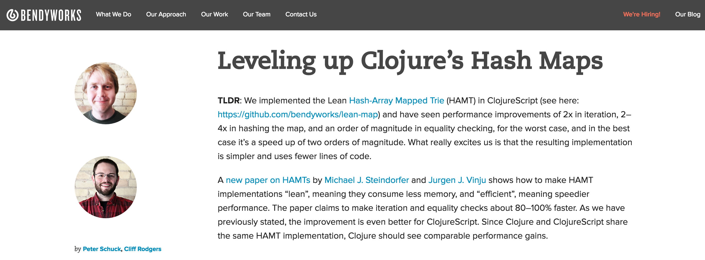

!SLIDE

# Clojure Spec:
## What to expect when you are specing

 
## Presented by Cliff Rodgers
## @bendyworks / @2kliph
 
## Content by Peter Schuck
## @bendyworks / @spinningtopsofdoom

!SLIDE
# Who are we?
##### bendyworks.com/blog

##### Hash Maps: more room at the bottom - Peter Schuck Clojure / West 2016
[https://youtu.be/GibNOQVelFY](https://youtu.be/GibNOQVelFY)

!SLIDE

# Clojure Spec Multitool

- Validation
- Destructuring
- Example Data
- Documentation
- Generative testing
- Actually helpful errors

!SLIDE

 
 
 
 
# Helpful errors, what is this __ELM__, we use 200+ line stack traces around here

!SLIDE

 
 
 
# Tonight's exercise: Big gnarly nested maps
